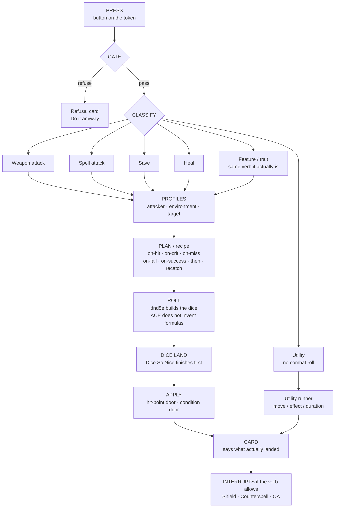

# ACE One Road — Mermaid flowchart

Paste the block below into [mermaid.live](https://mermaid.live) or any Markdown preview that supports Mermaid.

```mermaid
flowchart TD
  P["PRESS<br/>button on the token"] --> G{GATE}

  G -->|refuse| REF["Refusal card<br/>Do it anyway"]
  G -->|pass| C{CLASSIFY}

  C --> W["Weapon attack"]
  C --> SA["Spell attack"]
  C --> SV["Save"]
  C --> H["Heal"]
  C --> F["Feature / trait<br/>same verb it actually is"]
  C --> U["Utility<br/>no combat roll"]

  W --> PR
  SA --> PR
  SV --> PR
  H --> PR
  F --> PR
  U --> UR["Utility runner<br/>move / effect / duration"]

  PR["PROFILES<br/>attacker · environment · target"] --> PL["PLAN / recipe<br/>on-hit · on-crit · on-miss<br/>on-fail · on-success · then · recatch"]

  PL --> R["ROLL<br/>dnd5e builds the dice<br/>ACE does not invent formulas"]
  R --> D["DICE LAND<br/>Dice So Nice finishes first"]
  D --> A["APPLY<br/>hit-point door · condition door"]
  A --> K["CARD<br/>says what actually landed"]
  K --> I["INTERRUPTS if the verb allows<br/>Shield · Counterspell · OA"]

  UR --> K
```
