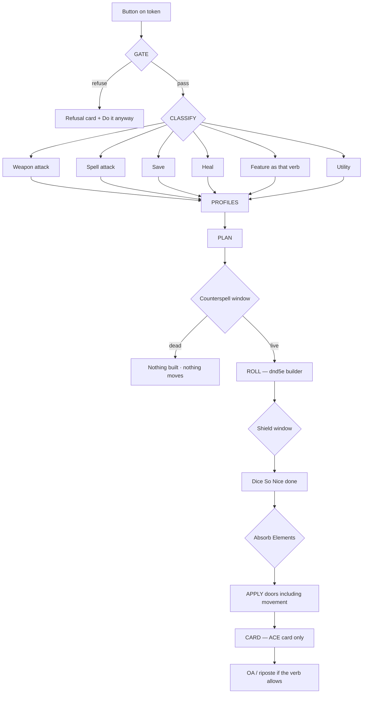

# ACE — One Road

What happens after you push a button on **ace-qol**.  
This is the combat operating model. Anything that does not live on this road is a side door.

**Modules stay separate.** QOL, Engine, and Forge each run alone.  
A sibling may **ask** the road. The road never reaches into a sibling.  
A missing sibling: log the skipped bridge and keep a defined table result (vanilla dnd5e / no FX / no AI). Do not crash.

A Forge trap is a Forge press with a Forge card. It may ask the road for a check and take the answer. That is the whole bridge. Traps do not move onto this executor.

---

## 1. The road

```text
PRESS
  → GATE
  → CLASSIFY
  → PROFILES
  → PLAN
  → [interrupt: Counterspell — before anything is built]
  → ROLL          dnd5e activity damage/attack config at roll time
  → [interrupt: Shield — after the attack roll, before hit is final]
  → DICE LAND     Dice So Nice finishes first. Nothing lands before its dice.
  → [interrupt: Absorb Elements — after damage is known, before it applies]
  → APPLY         hit-point door · condition door · movement door
  → CARD          report only. Never a vanilla dnd5e card.
                  No Foundry speaker strip. A DC only on a roll that
                  player is making. See section 13.
  → [interrupt: OA / riposte — after, when the verb allows]
```

Never card-first. Never apply from the card’s HTML. The card is a report.

---

## 2. Picture of a press



Utility uses the same doors. Mage Armor is the condition door. Misty Step is the movement door. Utility does not skip to the card.

---

## 3. Classify — keep it stupid

| Verb | Examples | Who builds the dice |
|---|---|---|
| Weapon attack | Rapier, bladed whip, bite | dnd5e activity damage config at roll time |
| Spell attack | Scorching Ray | same, spell attack |
| Save | Fireball, breath, Disintegrate | dnd5e save + plan fail / success |
| Heal | Cure Wounds, potion | dnd5e heal formula |
| Feature as a verb | Breath, Wing Attack | the verb it *is* |
| Utility | Misty Step, Time Stop, Mage Armor | no damage reader — still uses doors |

Multiattack is a loop of real verbs, not a verb.

---

## 4. Gate

Ask once, by name:

- Out of the fight
- Cannot take this action (reaction spent, no slot, not prepared)
- Illegal target for *this* verb
- GM **Do it anyway**

Gate does not roll. Gate does not place a template.

---

## 5. Profiles — filters, not engines

They never invent a damage formula.

```text
ATTACKER          ENVIRONMENT         TARGET
dead / dying      light / cover       AC / HP
conditions        terrain             dead vs dying vs 0 HP
Lucky / slots     area already down   conditions / resists
adv / dis         geometry            legal target?
```

Geometry: edge-touching counts. “Wholly within” only when the text says so.

---

## 6. Plan (recipe)

Keyed by **edition + item id** only. No name in the key.  
`(Legacy)` suffixes and a Forge rename must not mint a new recipe.

```text
kind / edition
onHit / onCrit / onMiss
onFail / onSuccess
then / recatch
```

- Sheet vs book disagree → show both, wait. No silent 5,000-item dumps.
- First unseen item: print the plan, confirm, store.
- Two readers, one authority:
  - **Roll time:** the activity’s own damage config is law.
  - **Describe time:** the recipe holds the written formula (no actor / ammo / mode yet).
  - A pin rolls a real weapon on a real actor and compares the two. Disagreement is loud.

---

## 7. Weapons

At roll time ACE does not assemble weapon damage. It asks the activity’s damage config.

Then ACE applies: profiles, crit *setting*, doors, card, Dice So Nice order.

dnd5e already knows:

- 5.x base die lives in `damage.base`
- `parts: []` + `includeBase: true` is normal
- `@mod` unless off-hand / flat / certain naturals
- magic bonus is its own part
- item crit bonus is after doubling, not instead of it
- proficiency is on the attack roll only

Copied rules with no link to dnd5e source will drift. The compare-pin is what makes drift visible.

**Live check — Jeth’s whip**

| Result | Should be |
|---|---|
| Hit | `1d4 + DEX (finesse) + magic` |
| Crit Max+Roll | maxed 1d4 + rolled 1d4 + mod + magic, plus item `2d4` |
| Crit RAW | `1d4+1d4 + mod + magic`, plus item `2d4` |

No `@mod` on a PC weapon card means the builder was skipped.

---

## 8. Execute

```text
run(plan, trigger, ctx)
```

QOL triggers: press, walk-in on a *spell* area, start of turn, end of turn, reaction.

A Forge trap asks this road for a check. It does not become a QOL trigger.

Doors:

- hit-point
- condition
- movement
- card

No `actor.update` for HP outside the hit-point door.  
No `ChatMessage.create` outside the card door.  
No token move for a dead (countered) cast.

---

## 9. Side doors — must be a release check, not prose

Ship fails if any of these grep hits exist in live paths:

- `ChatMessage.create` / `ChatMessage.createDocuments` outside the card door
- HP written outside the hit-point door
- APPLY reading totals out of card HTML
- attack path that never asks the activity damage config at roll time
- save card armed with no plan
- Forge FX playing a spell
- promote-to-named-actor when `game.actors.get(token.actorId)` already exists
- golden-record accept of items nobody looked at

---

## 10. Not this road

Engine NPC drop / factions. Forge traps and item editor. Teleport destination picker. Animation taste. Token art.

---

## 11. Done, in order

1. Weapons: dice + mod + magic. Crit matches setting. Card after dice. APPLY matches the plan. Whip + rapier on live tokens. Builder vs recipe pin is green.
2. Saves: fail ≠ success.
3. Heals: picker rules.
4. Interrupts at the three windows above. Countered cast never places, never moves, never rolls.
5. Features only as verbs.

---

## 12. Next build off this doc

The section 9 release check.  
Not a pipeline rewrite. Not Engine. Not Forge.

---

## 13. Every ACE card — the chrome law

Set 2026-09-29. This is not a save-card rule. It is every card ACE posts:
save, attack, damage, heal, reaction, refusal, trap, narration.

### 13.1 No speaker strip

Every ACE chat card hides Foundry's message header — the manila
"Name / DUNGEON MASTER" bar. The ⋮ stays, so the message can still be
deleted. Other chat keeps its strip: this is stamped onto ACE's own messages,
never applied globally.

Hidden by CSS on the stamp, revealed by nothing. A card the render pass never
reaches simply keeps the strip, which is ugly and harmless; the opposite
direction — hiding the whole header — takes the ⋮ with it and is not allowed.

### 13.2 A DC is shown on the roll that needs it

- **A player sees the DC on a roll they are making.** Lamia's DC 13 is on
  Jeth's Charm Person card, on Jeth's screen, because Jeth is rolling against
  it.
- **The GM always sees every DC.**
- **A DC is hidden only when it is not on a roll that player is making:** an
  unrevealed sheet, an unsprung trap, somebody else's save.

So the wrapper names the ROLLER, not whoever set the number:

```html
<span class="ace-qol-dc" data-dc-roller="${rollerActorId}">DC 14 Dexterity</span>
```

Revealed to the GM always, and to a player who owns that roller. No roller
named means nobody is rolling it yet, so it stays the GM's.

`tools/dc-check.mjs` fails the release on a DC that reaches a card outside the
wrapper. A line that belongs unwrapped says `dc-ok: <reason>`.

### 13.3 A monster's AC is never on a card

AC is not a save DC. It does not appear on any ACE card, on any screen.

### 13.4 What a card says about its own numbers

- One short formula, in the table's words: `Dex 1 (−5) + prof +3 = +0`.
  Never the word "proficiency".
- **No book-versus-sheet note in chat.** "+2 more than the sheet shows" and
  everything like it is a console line. Chat gets the number, the console gets
  the argument about it.
- A portrait is shown whole. Never cropped, never a 32px circle.
- The d20 face sits with the result it made: `5 − 2 = 3 FAIL`.
- A second roll is a second line. A table roll, a Topple die, a rider: its own
  line under the result, never a pill inside the row that holds the save.
